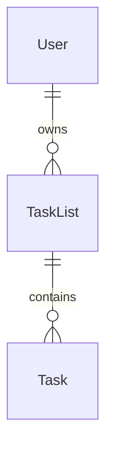

# TODO List Multi-usuário — Arquitetura fullstack

Enunciado, requisitos funcionais e critérios de avaliação: [README_CHALLENGE.md](README_CHALLENGE.md).

Este repositório é um **monorepo** com duas aplicações: API Spring Boot em `jtech-tasklist-backend` e SPA Vue em `jtech-tasklist-frontend`. O backend organiza **controllers → serviços de aplicação → repositórios JPA**; o frontend segue **Vue Router**, **Pinia** e pastas por responsabilidade.

---

## 1. Visão geral da arquitetura

O frontend cuida de interface, estado da aplicação e chamadas HTTP à API. O backend concentra regras de negócio, persistência com Hibernate, autenticação JWT e autorização por proprietário dos recursos.

A comunicação é REST (JSON). O domínio previsto para o produto completo relaciona **usuário**, **listas de tarefas** e **tarefas** (cada tarefa pertence a uma lista; cada lista pertence a um usuário), alinhado ao frontend multi-lista descrito no desafio e ao modelo User/Task exigido na avaliação.



Infraestrutura alvo: **Docker Compose** na raiz ([`docker-compose.yml`](docker-compose.yml): `db`, `backend`, `frontend`). Contrato REST documentado em [`docs/API_CONTRACT.md`](docs/API_CONTRACT.md).

---

## 2. Stack tecnológica

### Frontend (`jtech-tasklist-frontend`)

| Tecnologia | Papel |
|------------|--------|
| Vue 3 (Composition API) | Componentes e organização da UI |
| Vue Router 4 | Rotas públicas (login/registro) vs área autenticada; guards |
| Pinia | Estado global (`authStore` + `appStore` com módulos); plugin de persistência no browser |
| Axios | Cliente HTTP, interceptors de access/refresh |
| Vuetify | Material Design e formulários |
| TypeScript | Tipagem em views, stores, services e types |
| Vitest | Testes unitários de stores, composables e componentes críticos |

**Por quê:** combinação madura para SPA média; Axios centraliza tokens e renovação; Pinia com persistência reduz flicker após reload, aceitando a necessidade de sincronizar com a API quando os dados puderem estar defasados.

### Backend (`jtech-tasklist-backend`)

| Tecnologia | Papel |
|------------|--------|
| Java 17 | Alinhado ao `build.gradle` (compatível com imagem Docker e ambientes sem JDK 21) |
| Spring Boot 3.x | Aplicação web, auto-configuração |
| Spring Security | Filtros e regras de acesso; integração com validação de JWT |
| spring-boot-starter-oauth2-resource-server | Validação de JWT (Bearer) via `NimbusJwtDecoder` |
| JJWT | Emissão de access/refresh tokens (HS256), compatível com o decoder do Resource Server |
| Spring Data JPA + Hibernate | Mapeamento objeto-relacional (requisito do desafio); entidades nos adapters de saída |
| Flyway | Versionamento explícito do schema SQL, reprodutível entre ambientes |
| PostgreSQL | Banco principal em ambiente integrado |
| BCrypt | Hash de senha no registro |
| Spring Validation | Contratos de entrada |
| SpringDoc OpenAPI | Documentação e contratos HTTP (`config/infra/swagger`) |
| JUnit 5, Mockito, Spring Boot Test | Testes unitários e de integração |
| Testcontainers (PostgreSQL) | Testes de integração contra o mesmo motor do ambiente real |

**Por quê:** Hibernate atende o requisito explícito do desafio; Flyway evita depender só de `ddl-auto` para evolução do modelo; Testcontainers aproxima os testes do comportamento real do Postgres; Resource Server valida no pipeline Spring; JJWT centraliza a construção dos JWT na emissão.

### Infraestrutura

| Tecnologia | Papel |
|------------|--------|
| Docker / Docker Compose | Orquestrar API, frontend e PostgreSQL |

---

## 3. Estrutura do repositório e pastas

### Raiz

| Caminho | Conteúdo |
|---------|----------|
| [README.md](README.md) | Este documento |
| [README_CHALLENGE.md](README_CHALLENGE.md) | Especificação do desafio |
| [`docker-compose.yml`](docker-compose.yml) | Postgres (5433), API e Vite dev |
| [`docs/API_CONTRACT.md`](docs/API_CONTRACT.md) | Contrato REST da API |
| `jtech-tasklist-backend/` | API Spring Boot (Gradle) |
| `jtech-tasklist-frontend/` | Aplicação Vue (Vite + npm) |

### Backend — organização por responsabilidade

Extensão do estilo em camadas (controllers + serviços de aplicação + JPA):

| Pacote / pasta | Responsabilidade |
|----------------|------------------|
| `application/core/domains` | Exceções de domínio compartilhadas |
| `application/core/services` | Serviços de aplicação (`AuthService`, `TaskBoardService`) |
| `adapters/input/controllers` | Controllers REST |
| `adapters/input/protocols` | DTOs request/response |
| `adapters/output` | Implementações dos gateways (ex.: JPA) |
| `adapters/output/repositories` | Entidades JPA, Spring Data repositories |
| `config/security` | Security filter chain, JWT, CORS, BCrypt |
| `config/infra` | Swagger, tratamento global de exceções (`GlobalExceptionHandler`, etc.) |

### Frontend — organização por responsabilidade

O template Vue já define `views/`, `components/`, `router/`, `stores/`. A evolução **mantém** essa árvore e preenche o que ainda não existe:

| Pasta | Responsabilidade |
|-------|------------------|
| `src/views/` | Páginas (login, registro, área logada com listas/tarefas) |
| `src/components/` | Componentes reutilizáveis (lista, item, diálogos) |
| `src/router/` | Rotas e navigation guards (`index.ts`) |
| `src/stores/` | Pinia: `authStore` + `appStore` (módulos para listas, tarefas, lista ativa, etc.) — substituindo o store demo `counter.ts` |
| `src/services/` | Cliente Axios, interceptors de access/refresh |
| `src/composables/` | Lógica reutilizável (ex.: uso de formulários) |
| `src/types/` | Tipagens TypeScript compartilhadas |

---

## 4. Arquitetura do backend e equivalência com “camadas clássicas”

O desafio descreve **Controller → Service → Repository → Domain**. Neste repositório:

| Camada (desafio) | Onde fica aqui |
|-------------------------|----------------|
| Controller | `adapters/input/controllers` + `adapters/input/protocols` (DTOs) |
| Service | `application/core/services` (`AuthService`, `TaskBoardService`) |
| Repository | `adapters/output/repositories` (Spring Data JPA) |
| Entidades JPA | `adapters/output/repositories/entities` |
| Exceções de domínio | `application/core/exceptions` |

---

## 5. Aplicação de SOLID

- **S / O:** serviços com responsabilidade clara (`AuthService` vs `TaskBoardService`); extensão por novos métodos/controllers sem acoplar HTTP à JPA.
- **L / I / D:** controllers dependem de serviços; serviços usam repositórios Spring Data, mantendo o domínio de persistência nas entidades JPA.

---

## 6. Arquitetura do frontend (resumo)

Lógica de negócio de UI e sincronização com a API ficam em **stores** e **services**; componentes focam em apresentação e eventos. Rotas sensíveis exigem autenticação via **guards** no Vue Router.

---

## 7. Gerenciamento de estado e persistência de sessão

- **authStore:** usuário autenticado, tokens (access e refresh JWT), login, logout, registro e refresh.
- **appStore:** listas, tarefas, lista selecionada e fluxos de UI, organizados em **módulos/namespaces** para não concentrar tudo num único objeto plano.

Persistência no browser (Pinia + plugin de persistência): **tokens e cache de listas/tarefas**, para reduzir chamadas após F5; a implementação deve tratar dados possivelmente defasados (por exemplo, sincronizar após operações que alterem o servidor ou quando o refresh de token ocorrer).

---

## 8. Segurança

- Senhas com **BCrypt** no backend.
- **Access JWT** enviado pelo cliente em `Authorization: Bearer`. Validação no backend via **OAuth2 Resource Server** (integração com Spring Security).
- **Refresh JWT** de maior duração trocado no corpo JSON (ex.: `POST /auth/refresh`); **sem** cookie HttpOnly para o refresh neste desenho. O refresh **não** depende de tabela de sessão no servidor (simplicidade; revogação de tokens limitada — ver [trade-offs](#12-trade-offs)).
- Rotas protegidas conferem **propriedade** (usuário dono da lista/tarefa). O endpoint legado de criação de lista **sem** autenticação será **substituído** por `POST /task-lists` autenticado.

---

## 9. Banco de dados

**PostgreSQL** em container na stack Compose. A documentação do projeto usa a porta **5433** no host para reduzir conflito com instalações locais do Postgres.

O schema é evoluído com **Flyway**; o mapeamento objeto-relacional é feito com **Hibernate** via Spring Data JPA. A entidade `Tasklist` existente será **estendida** (usuário, nome, relação com tarefas, flags de arquivamento conforme o modelo), em vez de duplicar o conceito em outra tabela sem necessidade.

---

## 10. Como rodar localmente

### Com Docker Compose

Objetivo: na **raiz** do repositório:

```bash
docker compose up --build
```

Na raiz do monorepo, o Compose sobe Postgres (porta host **5433**), a API na porta **8080** e o Vite na **5173** (`npm run dev` no container). O frontend usa `VITE_API_BASE_URL=http://localhost:8080` (adequado ao acesso pelo navegador no host).

### Sem Docker (desenvolvimento)

**Backend** (Gradle Wrapper no módulo da API):

```bash
cd jtech-tasklist-backend
./gradlew bootRun
```

**Frontend:**

```bash
cd jtech-tasklist-frontend
npm install
npm run dev
```

Configure a URL da API (variável de ambiente ou arquivo `.env` do Vite, conforme implementação) para apontar para o backend local.

---

## 11. Como rodar os testes

**Backend:**

```bash
cd jtech-tasklist-backend
./gradlew test
```

**Frontend:**

```bash
cd jtech-tasklist-frontend
npm run test:unit
```

Os testes do backend priorizam a **camada de use cases** (sucesso e falha) e **testes de integração** dos endpoints com Spring Security, usando **Testcontainers** com **PostgreSQL** para ficar alinhado ao banco real. No frontend, Vitest cobre stores, composables e componentes críticos.

---

## 12. Trade-offs

- **Refresh JWT sem sessão no servidor:** simplifica deploy e código, mas revogação imediata e rotação agressiva ficam limitadas; logout pode ser tratado só no cliente ou com TTL curto do access token.
- **Cache de listas/tarefas no Pinia:** melhora UX após reload; exige disciplina para não exibir estado velho após mutações ou refresh de token.
- **Erros HTTP:** permanecem no formato centralizado pelo `GlobalExceptionHandler`, sem adotar Problem Details neste ciclo (menos trabalho, menos padronização externa).
- **DDD estrito / eventos:** não são obrigatórios para o desafio; o domínio permanece enxuto dentro dos use cases.
- **Docker:** Compose na raiz é o alvo para DX; até lá, desenvolvimento com processos locais e Postgres opcional.

---

## 13. Decisões técnicas aprofundadas

Decisões abaixo referem-se a **frameworks, bibliotecas, padrões e ferramentas** acordados para a implementação (não entram aqui argumentos sobre formato específico de URL escolhido entre alternativas equivalentes).

- **Camadas no backend:** controllers finos (`adapters/input/controllers`), regras em serviços (`application/core/services`), persistência com Spring Data e Flyway.
- **spring-boot-starter-oauth2-resource-server:** validação de JWT no stack oficial Spring Security (`NimbusJwtDecoder`).
- **JJWT:** emissão de access/refresh com HS256, alinhada à mesma chave configurada em `app.jwt.secret`.
- **Flyway + Hibernate (Spring Data JPA):** o desafio exige Hibernate; Flyway torna migrations explícitas e reprodutíveis em vez de depender apenas de geração automática de schema.
- **Testcontainers com PostgreSQL:** testes de integração usam o mesmo dialeto e recursos do banco de produção, reduzindo surpresas em relação a H2.
- **Axios:** interceptors para anexar access token e orquestrar refresh a partir de 401 ou política definida na camada de serviço HTTP.
- **Pinia com `authStore` + `appStore` e módulos:** separa autenticação do restante do estado da aplicação sem multiplicar stores pequenos demais ou um único store sem fronteiras.
- **Plugin de persistência do Pinia:** permite guardar tokens e cache de domínio no browser, coerente com a decisão de reduzir round-trips após reload (com os trade-offs da [seção 12](#12-trade-offs)).
- **Tratamento de erros:** manter o [`GlobalExceptionHandler`](jtech-tasklist-backend/src/main/java/br/com/jtech/tasklist/config/infra/utils/GlobalExceptionHandler.java) como ponto único, sem impor Problem Details neste momento.
- **Modelo de tokens:** access JWT de vida curta (típico) + refresh JWT de vida longa **sem** persistência de sessão de refresh no banco — simplicidade operacional; ver limitações em [trade-offs](#12-trade-offs).
- **Docker Compose (frontend):** container do frontend executando **Vite em modo dev** para hot reload no ambiente composto.
- **Monorepo e Java 17:** facilita alinhar tipos TypeScript com a API; `sourceCompatibility`/`targetCompatibility` no `build.gradle`.
- **Integração login/API:** o desafio exige JWT e CRUD no backend; o frontend usa a API real (qualquer “login mock” do enunciado seria apenas atalho de UX, não substitui JWT).

**Comportamento de domínio (referência):** exclusão lógica de listas e tarefas, com listagem de itens arquivados e operação de desarquivar; validação de tarefa por obrigatoriedade e tamanho máximo, **sem** regra de unicidade de título.

---

## 14. Melhorias e roadmap

- Compose na raiz com PostgreSQL (porta 5433), backend e frontend (Vite dev conforme decisão atual); opcional futuro: imagem nginx servindo build estático de produção.
- Refresh token com rotação, denylist ou sessões persistidas se exigir revogação forte.
- CI (build + testes backend e frontend).
- Observabilidade (logs estruturados, métricas).
- Cache (Redis) e filas, se o produto crescer além do escopo do desafio.

---

## 15. Considerações finais

O projeto prioriza **extensão coerente** do código existente, documentação alinhada ao desafio e separação clara de responsabilidades, permitindo evoluir segurança e domínio sem reescrita desnecessária.
